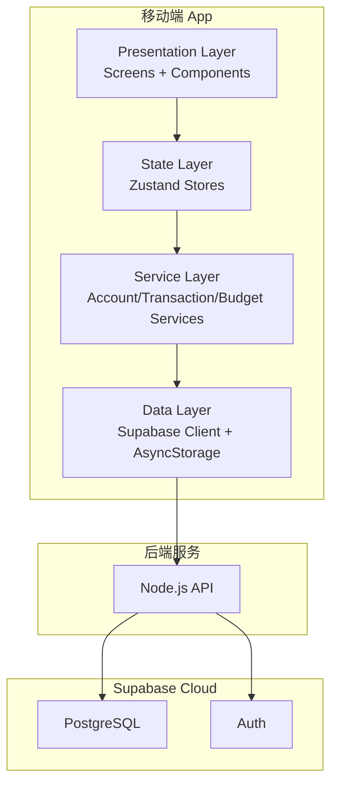

# 财务管理 App 技术规范

**文档版本**：V1.0
**日期**：2026-03-07

---

## 一、项目概述

### 1.1 项目定位

**财务管理 App（火伴/Firemate）** 是一款个人财务管理应用，帮助用户追踪收入、支出、转账，管理预算和储蓄目标。

### 1.2 核心价值

- 一个界面看清所有钱 - 把散落各处的账户汇总到一起
- 记账尽可能简单 - 几步完成，不打断用户的消费节奏
- 知道钱去了哪里 - 分类统计，清晰了解消费结构
- 能存下钱 - 通过预算控制和目标储蓄，帮助用户养成储蓄习惯

---

## 二、技术选型

### 2.1 核心技术栈

| 层级 | 技术选型 | 说明 |
|------|----------|------|
| **前端框架** | React Native (Expo SDK 52+) | 跨平台移动端开发 |
| **编程语言** | TypeScript 5.x | 类型安全 |
| **状态管理** | Zustand 5.x | 轻量级状态管理 |
| **后端** | Node.js | 业务逻辑处理 |
| **数据库/认证** | Supabase | PostgreSQL + Auth |
| **路由** | Expo Router | 文件路由系统 |
| **图表** | react-native-gifted-charts | 数据可视化 |
| **本地存储** | AsyncStorage | 轻量数据缓存 |
| **表单验证** | zod | 数据校验 |

### 2.2 目标平台

- **Android 优先**：首版支持 Android，确保核心功能稳定
- **iOS 扩展**：后续版本支持 iOS

### 2.2 开发工具

| 工具 | 用途 |
|------|------|
| Expo | 开发、构建、发布 |
| Prettier | 代码格式化 |
| ESLint | 代码检查 |
| Jest | 单元测试 |

---

## 三、架构设计

### 3.1 整体架构



**架构说明**：
- **展示层 (Presentation)**：页面和组件
- **状态层 (State)**：Zustand 全局状态管理
- **服务层 (Service)**：业务逻辑封装
- **数据层 (Data)**：Supabase 客户端 + 本地缓存

### 3.2 分层职责

| 层级 | 职责 | 文件位置 |
|------|------|----------|
| Presentation | UI 展示，页面组件 | `app/`, `components/` |
| State | 全局状态管理 | `stores/` |
| Service | 业务逻辑封装 | `services/` |
| Data | 数据访问，API 调用 | `lib/supabase.ts` |

---

## 四、数据模型

### 4.1 核心实体

| 实体 | 说明 | 存储方式 |
|------|------|----------|
| Account (账户) | 资金渠道 | PostgreSQL |
| Transaction (流水) | 交易记录 | PostgreSQL |
| Budget (预算) | 月度预算 | PostgreSQL |
| Goal (目标) | 储蓄目标 | PostgreSQL |
| Category (分类) | 收支分类 | PostgreSQL |

### 4.2 分类体系

**支出分类（二级）**：
- 餐饮（早餐、午餐、晚餐、零食、外卖）
- 交通（公交、地铁、出租、加油、停车）
- 购物（服装、日用品、电子产品）
- 居住（房租、水电、物业）
- 娱乐（电影、游戏、旅游）
- 医疗（门诊、药品、保险）
- 教育（培训、书籍、课程）
- 其他

**收入分类**：
- 工资（月薪、奖金）
- 兼职（外快、项目收入）
- 投资（股票收益、基金收益）
- 其他（红包、礼金）

### 4.3 账户类型

- 现金
- 银行卡（储蓄卡、信用卡）
- 第三方支付（微信、支付宝）
- 投资账户（股票、基金）
- 储蓄账户（定期、理财）

---

## 五、数据库设计

### 5.1 表结构

#### accounts (账户表)

```sql
CREATE TABLE accounts (
  id UUID PRIMARY KEY DEFAULT gen_random_uuid(),
  user_id UUID REFERENCES auth.users(id),
  name TEXT NOT NULL,
  type TEXT NOT NULL CHECK (type IN ('cash', 'bank_card', 'third_party', 'investment', 'savings')),
  balance DECIMAL(15,2) DEFAULT 0,
  icon TEXT,
  color TEXT,
  note TEXT,
  is_deleted BOOLEAN DEFAULT FALSE,
  created_at TIMESTAMPTZ DEFAULT NOW(),
  updated_at TIMESTAMPTZ DEFAULT NOW()
);
```

#### transactions (流水表)

```sql
CREATE TABLE transactions (
  id UUID PRIMARY KEY DEFAULT gen_random_uuid(),
  user_id UUID REFERENCES auth.users(id),
  type TEXT NOT NULL CHECK (type IN ('income', 'expense', 'transfer')),
  category_id UUID REFERENCES categories(id),
  amount DECIMAL(15,2) NOT NULL,
  account_id UUID REFERENCES accounts(id),
  to_account_id UUID REFERENCES accounts(id),
  date DATE NOT NULL DEFAULT CURRENT_DATE,
  note TEXT,
  created_at TIMESTAMPTZ DEFAULT NOW()
);
```

#### budgets (预算表)

```sql
CREATE TABLE budgets (
  id UUID PRIMARY KEY DEFAULT gen_random_uuid(),
  user_id UUID REFERENCES auth.users(id),
  amount DECIMAL(15,2) NOT NULL,
  month DATE NOT NULL,
  modified_count INTEGER DEFAULT 0,
  last_modified_at TIMESTAMPTZ,
  created_at TIMESTAMPTZ DEFAULT NOW(),
  UNIQUE(user_id, month)
);
```

#### goals (目标表)

```sql
CREATE TABLE goals (
  id UUID PRIMARY KEY DEFAULT gen_random_uuid(),
  user_id UUID REFERENCES auth.users(id),
  name TEXT NOT NULL,
  target_amount DECIMAL(15,2) NOT NULL,
  linked_account_id UUID REFERENCES accounts(id),
  status TEXT DEFAULT 'active' CHECK (status IN ('active', 'achieved')),
  created_at TIMESTAMPTZ DEFAULT NOW()
);
```

### 5.2 安全策略

```sql
-- 启用 Row Level Security
ALTER TABLE accounts ENABLE ROW LEVEL SECURITY;
ALTER TABLE transactions ENABLE ROW LEVEL SECURITY;
ALTER TABLE budgets ENABLE ROW LEVEL SECURITY;
ALTER TABLE goals ENABLE ROW LEVEL SECURITY;

-- 用户只能访问自己的数据
CREATE POLICY "Users can access own data" ON accounts
  FOR ALL USING (auth.uid() = user_id);
-- 其他表类似...
```

---

## 六、目录结构

```
finance-app/
├── app/                          # Expo Router 页面
│   ├── (tabs)/                   # 底部标签页
│   │   ├── _layout.tsx
│   │   ├── index.tsx            # 首页
│   │   ├── add.tsx              # 记一笔
│   │   ├── accounts/            # 账户
│   │   └── more/                # 更多
│   └── +layout.tsx              # 根布局
├── components/                   # 通用组件
│   ├── AccountCard.tsx
│   ├── TransactionItem.tsx
│   ├── BudgetProgress.tsx
│   ├── GoalCard.tsx
│   └── common/
├── stores/                       # Zustand 状态
├── services/                     # 业务服务
├── lib/                         # 工具库
│   ├── supabase.ts              # Supabase 客户端
│   └── constants.ts              # 常量
├── types/                       # TypeScript 类型
└── data/                        # 初始数据
```

---

## 七、功能清单

### 7.1 V1.0 功能

| 模块 | 功能 |
|------|------|
| 账户管理 | 创建/编辑/删除账户，按类型分组显示 |
| 记账功能 | 记录收入/支出，支持二级分类 |
| 内部转账 | 账户间转账，不计入收支统计 |
| 首页仪表盘 | 总资产、本月收支、预算进度、最近流水 |
| 预算管理 | 月度预算设置，进度条颜色预警 |
| 报表可视化 | 饼图（支出分类）、折线图（趋势）、条形图（账户余额） |
| 目标储蓄 | 创建储蓄目标，关联账户，进度追踪 |

### 7.2 认证模式

| 模式 | 说明 |
|------|------|
| 匿名登录 | 本地使用，无需注册，数据存储在本地 |
| 邮箱注册 | 需要云端同步时使用，数据同步到 Supabase |

---

## 八、非功能性需求

### 8.1 性能要求

- 页面加载时间 < 2秒
- 记账操作响应时间 < 500ms
- 图表渲染时间 < 1秒

### 8.2 兼容性

- Android SDK 21+ (最低)
- iOS 12.0+ (最低)
- Expo SDK 52+

### 8.3 安全

- RLS 行级安全
- HTTPS 传输加密
- 金额使用 DECIMAL 类型避免浮点误差

---

## 九、版本规划

| 版本 | 内容 |
|------|------|
| V1.0 | 账户管理、手动记账、转账、首页仪表盘、预算管理、报表可视化、目标储蓄 |
| V2.0 | 语音记账、分类预算、资产管理（股票/基金） |

---

## 十、参考资料

- React Native 官方文档：https://reactnative.dev
- Expo 文档：https://docs.expo.dev
- Supabase 文档：https://supabase.com/docs
- Zustand 状态管理：https://zustand-demo.pmnd.rs

---

*本文档为财务管理 App 的整体技术规范，定义项目技术选型与架构方向。*
