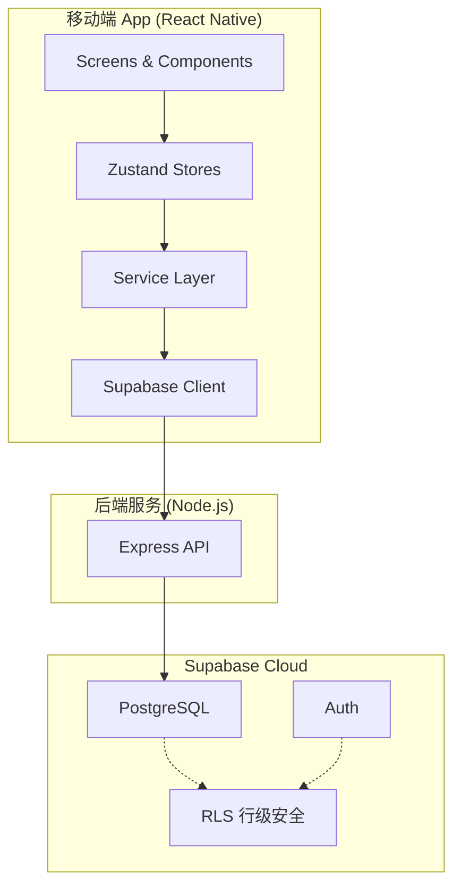

# 技术方案：财务管理 App V1.0

**分支**：`001-finance-app`
**版本**：V1.0
**技术栈**：React Native (Expo) + Node.js + Supabase

---

## 一、技术选型

### 1.1 核心技术栈

| 层级 | 技术选型 | 版本要求 |
|------|----------|----------|
| 前端框架 | React Native (Expo) | SDK 52+ |
| 编程语言 | TypeScript | 5.x |
| 状态管理 | Zustand | 5.x |
| 数据库 | Supabase (PostgreSQL) | - |
| 认证 | Supabase Auth | - |
| 后端服务 | Node.js + Express | Node.js 20+ |
| 路由 | React Navigation | 7.x |
| 图表 | react-native-gifted-charts | 1.x |
| 本地存储 | @react-native-async-storage/async-storage | 2.x |
| 表单验证 | zod | 3.x |

### 1.2 开发工具

| 工具 | 用途 |
|------|------|
| Expo | 开发、构建、发布 |
| Expo Router | 文件路由 |
| Prettier | 代码格式化 |
| ESLint | 代码检查 |
| Jest | 单元测试 |

---

## 二、架构设计

### 2.1 整体架构



**架构说明**：
- **移动端**：展示层 → 状态层 → 服务层 → 数据层
- **后端**：Node.js 处理业务逻辑
- **云端**：Supabase 提供数据库和认证

### 2.2 分层说明

| 层级 | 职责 | 文件位置 |
|------|------|----------|
| **Presentation** | UI 展示，页面组件 | `app/(tabs)`, `components/` |
| **State** | 全局状态管理 | `stores/` |
| **Service** | 业务逻辑封装 | `services/` |
| **Data** | 数据访问，API 调用 | `lib/supabase.ts` |
| **Infrastructure** | 基础设施配置 | `app.config.ts` |

---

## 三、数据库设计

### 3.1 表结构

#### 3.1.1 账户表 (accounts)

```sql
CREATE TABLE accounts (
  id UUID PRIMARY KEY DEFAULT gen_random_uuid(),
  user_id UUID REFERENCES auth.users(id),
  name TEXT NOT NULL,
  type TEXT NOT NULL CHECK (type IN ('cash', 'bank_card', 'third_party', 'investment', 'savings')),
  balance DECIMAL(15,2) DEFAULT 0,
  icon TEXT,
  color TEXT,
  note TEXT,
  is_deleted BOOLEAN DEFAULT FALSE,
  created_at TIMESTAMPTZ DEFAULT NOW(),
  updated_at TIMESTAMPTZ DEFAULT NOW()
);
```

#### 3.1.2 分类表 (categories)

```sql
CREATE TABLE categories (
  id UUID PRIMARY KEY DEFAULT gen_random_uuid(),
  user_id UUID REFERENCES auth.users(id),
  name TEXT NOT NULL,
  type TEXT NOT NULL CHECK (type IN ('expense', 'income')),
  parent_id UUID REFERENCES categories(id),
  icon TEXT,
  is_default BOOLEAN DEFAULT FALSE,
  created_at TIMESTAMPTZ DEFAULT NOW()
);
```

#### 3.1.3 流水表 (transactions)

```sql
CREATE TABLE transactions (
  id UUID PRIMARY KEY DEFAULT gen_random_uuid(),
  user_id UUID REFERENCES auth.users(id),
  type TEXT NOT NULL CHECK (type IN ('income', 'expense', 'transfer')),
  category_id UUID REFERENCES categories(id),
  amount DECIMAL(15,2) NOT NULL,
  account_id UUID REFERENCES accounts(id),
  to_account_id UUID REFERENCES accounts(id),  -- 转账用
  date DATE NOT NULL DEFAULT CURRENT_DATE,
  note TEXT,
  created_at TIMESTAMPTZ DEFAULT NOW()
);
```

#### 3.1.4 预算表 (budgets)

```sql
CREATE TABLE budgets (
  id UUID PRIMARY KEY DEFAULT gen_random_uuid(),
  user_id UUID REFERENCES auth.users(id),
  amount DECIMAL(15,2) NOT NULL,
  month DATE NOT NULL,  -- 格式：YYYY-MM-01
  modified_count INTEGER DEFAULT 0,
  last_modified_at TIMESTAMPTZ,
  created_at TIMESTAMPTZ DEFAULT NOW(),
  UNIQUE(user_id, month)
);
```

#### 3.1.5 目标表 (goals)

```sql
CREATE TABLE goals (
  id UUID PRIMARY KEY DEFAULT gen_random_uuid(),
  user_id UUID REFERENCES auth.users(id),
  name TEXT NOT NULL,
  target_amount DECIMAL(15,2) NOT NULL,
  linked_account_id UUID REFERENCES accounts(id),
  status TEXT DEFAULT 'active' CHECK (status IN ('active', 'achieved')),
  created_at TIMESTAMPTZ DEFAULT NOW()
);
```

### 3.2 Row Level Security (RLS)

```sql
-- 启用 RLS
ALTER TABLE accounts ENABLE ROW LEVEL SECURITY;
ALTER TABLE transactions ENABLE ROW LEVEL SECURITY;
ALTER TABLE budgets ENABLE ROW LEVEL SECURITY;
ALTER TABLE goals ENABLE ROW LEVEL SECURITY;

-- 创建策略：用户只能访问自己的数据
CREATE POLICY "Users can access own accounts" ON accounts
  FOR ALL USING (auth.uid() = user_id);

CREATE POLICY "Users can access own transactions" ON transactions
  FOR ALL USING (auth.uid() = user_id);

CREATE POLICY "Users can access own budgets" ON budgets
  FOR ALL USING (auth.uid() = user_id);

CREATE POLICY "Users can access own goals" ON goals
  FOR ALL USING (auth.uid() = user_id);
```

---

## 四、关键业务逻辑

### 4.1 账户余额计算

```typescript
// 账户余额 = 初始余额 + 收入 - 支出 + 转入 - 转出
async function calculateAccountBalance(accountId: string): Promise<number> {
  const { data } = await supabase.rpc('calculate_balance', {
    p_account_id: accountId
  });
  return data;
}
```

**Node.js API 实现** (`/api/accounts/:id/balance`):

```typescript
// server/src/routes/accounts.ts
import { Router } from 'express';
import { supabase } from '../lib/supabase';

const router = Router();

router.get('/:id/balance', async (req, res) => {
  const { id } = req.params;

  // 查询收入总和
  const { data: income } = await supabase
    .from('transactions')
    .select('amount')
    .eq('account_id', id)
    .eq('type', 'income');

  // 查询支出总和
  const { data: expense } = await supabase
    .from('transactions')
    .select('amount')
    .eq('account_id', id)
    .eq('type', 'expense');

  // 查询转入
  const { data: transferIn } = await supabase
    .from('transactions')
    .select('amount')
    .eq('to_account_id', id)
    .eq('type', 'transfer');

  // 查询转出
  const { data = await supabase: transferOut }
    .from('transactions')
    .select('amount')
    .eq('account_id', id)
    .eq('type', 'transfer');

  const total = (sum(income) || 0) - (sum(expense) || 0)
             + (sum(transferIn) || 0) - (sum(transferOut) || 0);

  res.json({ total });
});

export default router;
```

### 4.2 转账事务处理

```typescript
async function createTransfer(
  fromAccountId: string,
  toAccountId: string,
  amount: number,
  date: Date,
  note?: string
) {
  // 使用数据库事务确保数据一致性
  const { error } = await supabase.rpc('create_transfer', {
    p_from_account: fromAccountId,
    p_to_account: toAccountId,
    p_amount: amount,
    p_date: date.toISOString().split('T')[0],
    p_note: note || null
  });

  if (error) throw error;
}
```

### 4.3 预算修改限制

```typescript
async function updateBudget(month: string, newAmount: number) {
  const { data: budget } = await supabase
    .from('budgets')
    .select('modified_count, last_modified_at')
    .eq('month', month)
    .single();

  const now = new Date();
  const currentMonth = now.toISOString().slice(0, 7);

  // 检查是否超过每月修改限制
  if (budget?.modified_count >= 1 && month.startsWith(currentMonth)) {
    throw new Error('本月已修改过预算');
  }

  // 更新预算
  const { error } = await supabase
    .from('budgets')
    .upsert({
      month,
      amount: newAmount,
      modified_count: (budget?.modified_count || 0) + 1,
      last_modified_at: now.toISOString()
    });
}
```

---

## 五、目录结构

```
finance-app/
├── app/                          # Expo Router 页面
│   ├── (tabs)/                   # 底部标签页
│   │   ├── _layout.tsx
│   │   ├── index.tsx            # 首页/仪表盘
│   │   ├── add.tsx              # 记一笔
│   │   ├── accounts/
│   │   │   ├── index.tsx        # 账户列表
│   │   │   └── [id].tsx         # 账户详情
│   │   └── more/                # 更多页面
│   │       ├── reports.tsx      # 报表
│   │       ├── budget.tsx      # 预算
│   │       └── goals.tsx       # 目标
│   └── +layout.tsx              # 根布局
├── components/                   # 通用组件
│   ├── AccountCard.tsx
│   ├── TransactionItem.tsx
│   ├── BudgetProgress.tsx
│   ├── GoalCard.tsx
│   ├── CategoryPicker.tsx
│   └── common/
│       ├── Button.tsx
│       ├── Input.tsx
│       └── Modal.tsx
├── stores/                       # Zustand 状态
│   ├── accountStore.ts
│   ├── transactionStore.ts
│   ├── budgetStore.ts
│   └── goalStore.ts
├── services/                     # 业务服务
│   ├── accountService.ts
│   ├── transactionService.ts
│   ├── budgetService.ts
│   └── goalService.ts
├── lib/                         # 工具库
│   ├── supabase.ts              # Supabase 客户端
│   ├── constants.ts              # 常量
│   └── utils.ts                 # 工具函数
├── types/                       # TypeScript 类型
│   └── index.ts
└── data/                        # 初始数据
    └── categories.json           # 默认分类数据
```

---

## 六、离线支持策略

### 6.1 本地缓存方案

使用 **AsyncStorage** 缓存关键数据：

```typescript
// 缓存策略
const cacheKeys = {
  accounts: '@finance/accounts',
  categories: '@finance/categories',
  settings: '@finance/settings'
};

// 读取缓存
async function getCachedAccounts() {
  const cached = await AsyncStorage.getItem(cacheKeys.accounts);
  return cached ? JSON.parse(cached) : null;
}

// 写入缓存
async function setCachedAccounts(accounts: Account[]) {
  await AsyncStorage.setItem(cacheKeys.accounts, JSON.stringify(accounts));
}
```

### 6.2 离线优先策略

1. **优先读取本地缓存**
2. **后台同步到云端**
3. **冲突处理：以后写入为准**

---

## 七、安全考虑

### 7.1 认证模式

| 模式 | 实现方式 | 适用场景 |
|------|----------|----------|
| 匿名登录 | Supabase 匿名认证 | 本地使用，无需注册 |
| 邮箱注册 | Supabase Email Auth | 需要云端同步 |
| 后续支持 | OAuth (Google/Apple) | 第三方登录 |

### 7.2 数据安全

- ✅ RLS 行级安全：用户只能访问自己的数据
- ✅ HTTPS 传输加密
- ✅ 敏感数据（如金额）使用 DECIMAL 类型避免浮点误差

---

## 八、后续扩展

### 8.1 V2.0 预留

| 功能 | 技术准备 |
|------|----------|
| 语音记账 | React Native Voice / 第三方语音 SDK |
| 云端同步 | Supabase Realtime 订阅 |
| 数据导出 | 生成 JSON/CSV 文件 |
| 推送通知 | Expo Notifications |

### 8.2 性能优化

- 分页加载流水列表（每页 20 条）
- 图片/图标使用 CDN
- 图表数据预计算

---

*本文档为 V1.0 迭代的技术方案，基于 React Native + Node.js + Supabase 架构。*
